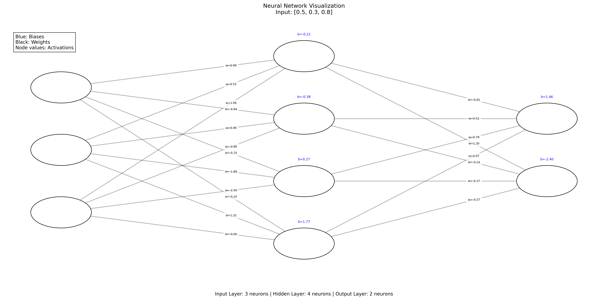

# Neural Network Forward Propagation with Visualization



A Python implementation of neural network forward propagation with comprehensive visualization capabilities.

## Features

- **Complete Network Visualization**:
  - Node activations (sigmoid outputs)
  - Connection weights
  - Layer biases
  - Input values

- **Customizable Architecture**:
  - Flexible layer configurations
  - Adjustable network parameters
  - Interactive visualization

- **Detailed Output**:
  - Clear separation of weights and biases
  - Color-coded elements
  - High-resolution PNG export

## Installation

1. Clone the repository:
```bash
git clone https://github.com/yourusername/Neural-Network-Forward-Propagation.git
cd Neural-Network-Forward-Propagation
```

Install dependencies:

pip install -r requirements.txt


Basic Usage - python
 
from neural_network.nn_forward_prop import NeuralNetwork

# Create a network
network = NeuralNetwork([3, 4, 2])  # 3 inputs, 4 hidden neurons, 2 outputs

# Run forward propagation
inputs = [0.5, 0.3, 0.8]
output, _ = network.forward_propagate(inputs)
print("Network output:", output)
Visualization Example
Run the enhanced visualization:

python examples/network_visualization.py
This will generate:

An interactive matplotlib window

A high-resolution organized_network.png file

Visualization Features
Element	Position	Color	Format
Node Activations	Inside circle	Black	0.00
Connection Weights	Near destination	Black	w=0.00
Layer Biases	Above node	Blue	b=0.00
Input Values	Title	-	[0.0, 0.0]

Requirements

Python 3.8+

NumPy

Matplotlib

Contributing
Contributions are welcome! Please open an issue or submit a pull request.
